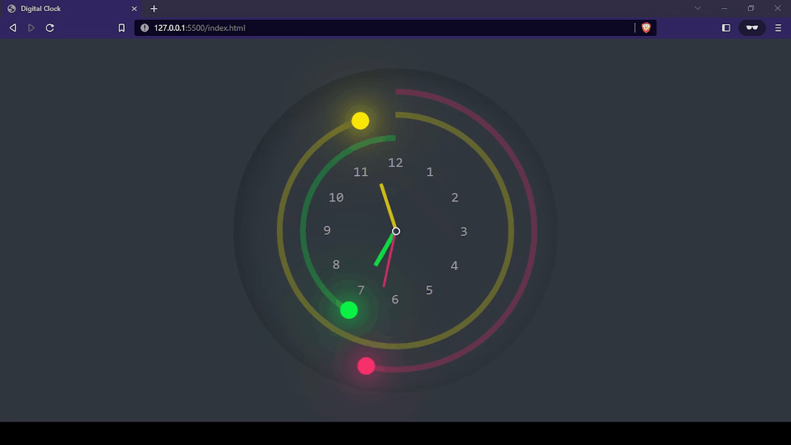

<h1 align="center">Classic clock</h1>

 

  <a href="#-tecnologias">Tecnologias</a>&nbsp;&nbsp;&nbsp;|&nbsp;&nbsp;&nbsp;
  <a href="#-projeto">Projeto</a>&nbsp;&nbsp;&nbsp;|&nbsp;&nbsp;&nbsp;
   <a href="#memo-licença">Licença</a>

  

 

  

## 🚀 Tecnologias

Esse projeto foi desenvolvido com as seguintes tecnologias:

- HTML e CSS
- JavaScript
- Git e Github

## 💻 Projeto

Esse projeto faz parte de lista de vídeos do Youtube do canal Online Tutorials que sempre tem exemplos muito maneiros e criativos de animações e componentes para usarmos no dia a dia.

## Referência

Link do canal <a href="https://www.youtube.com/watch?v=FKQqFn2j0Ys&list=WL&index=34">aqui</a>.

## :memo: Licença

Esse projeto está sob a licença MIT.

---
